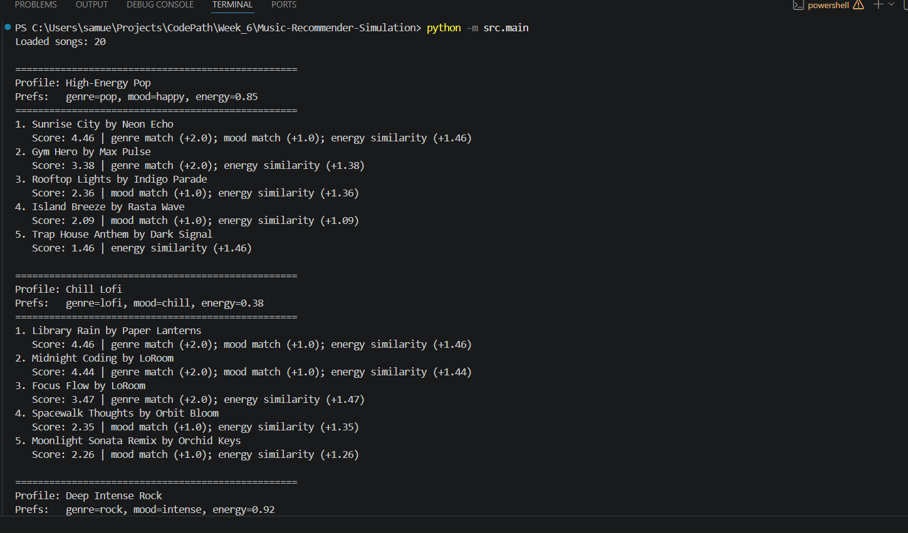
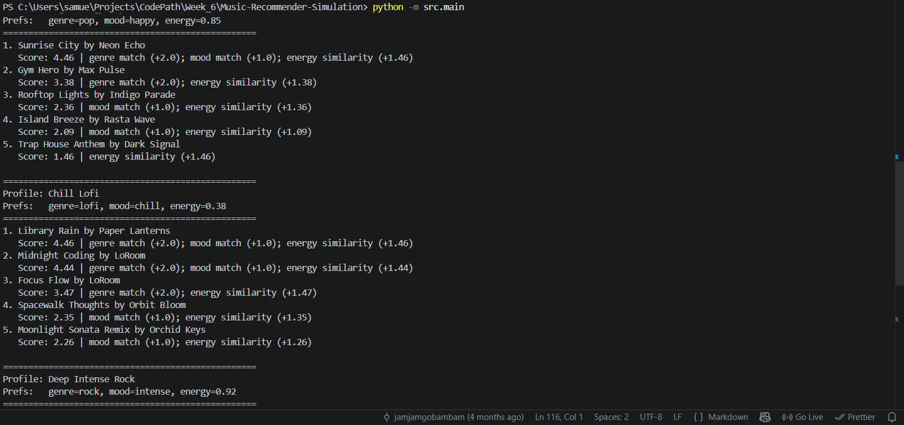

# Music Recommender Simulation

## Project Summary

This project simulates a simple content-based music recommender system. Given a user's preferred genre, mood, and energy level, the system scores every song in a 20-song catalog and returns the top recommendations. The goal is to demonstrate how real platforms like Spotify use weighted feature matching to surface relevant content, and to explore the trade-offs and biases that come with any scoring-based approach.

---

## How The System Works

### Real-World Context
Real recommender systems at Spotify and YouTube rely on a combination of collaborative filtering (finding users with similar taste), content-based filtering (matching song attributes), and deep learning on raw audio. They factor in implicit signals like skip rate, replay count, and time-of-day context to continuously refine what a user sees next. At scale, this runs over millions of songs and is personalized per listener in real time.

### This Simulation
This version prioritizes content-based filtering using a small, hand-crafted song catalog. It works in three stages:

**Input (User Preferences)**
```
{ "genre": "pop", "mood": "happy", "energy": 0.85 }
```

**Process (Score Every Song)**

Each song is evaluated using this algorithm recipe:

| Rule | Points |
|---|---|
| Genre matches user's preferred genre | +2.0 |
| Mood matches user's preferred mood | +1.0 |
| Energy closeness: `(1 - abs(song_energy - target_energy)) * 1.5` | 0.0 – 1.5 |

A genre match is worth double a mood match because genre is the strongest categorical boundary between listener preferences. Energy is scored continuously so songs close to the target energy are rewarded proportionally, not just binarily.

**Output (Top-K Ranking)**
Songs are sorted from highest to lowest score and the top-K are returned with a human-readable explanation of why each was recommended.

```
flowchart LR
    A[User Preferences\ngenre, mood, energy] --> B[Score Every Song\nin the catalog]
    B --> C{+2.0 genre match\n+1.0 mood match\n+0–1.5 energy sim}
    C --> D[Sort all songs\nhighest score first]
    D --> E[Return Top-K\nwith explanations]
```

### Features Used

**Song object:** `genre`, `mood`, `energy`, `tempo_bpm`, `valence`, `danceability`, `acousticness`

**UserProfile object:** `favorite_genre`, `favorite_mood`, `target_energy`, `likes_acoustic`

---

## Getting Started

### Setup

1. Create a virtual environment (optional but recommended):

   ```bash
   python -m venv .venv
   source .venv/bin/activate      # Mac or Linux
   .venv\Scripts\activate         # Windows
   ```

2. Install dependencies:

   ```bash
   pip install -r requirements.txt
   ```

3. Run the app:

   ```bash
   python -m src.main
   ```

### Running Tests

```bash
pytest
```

---

## Experiments

### Weight Shift: Genre vs. Mood
With the default weights (genre +2.0, mood +1.0), the "Deep Intense Rock" profile surfaces Storm Runner clearly at the top. When genre weight was halved to +1.0, high-energy songs from other genres (EDM, Metal) competed more closely for the top spot — confirming genre is the dominant separator at the default setting.

### Feature Removal: Removing Mood
Commenting out the mood bonus caused the "Chill Lofi" profile to rank Focus Flow above Library Rain and Midnight Coding, even though it carries a "focused" mood rather than "chill." This demonstrates that mood is doing real differentiation work even when genre already provides a strong match.

### Adversarial Profile: Conflicting Preferences
Testing `{ "genre": "edm", "mood": "sad", "energy": 0.95 }` — a user who wants high-energy EDM but in a sad mood — revealed a limitation: no song in the catalog has both high energy and a sad mood, so the system falls back to pure energy similarity as the tiebreaker and the "sad" mood goes unmatched entirely.

---

## Limitations and Risks

- The catalog has only 20 songs, so several genres have just one representative. This causes popular genres like lofi to have a natural scoring advantage.
- The system has no memory — it treats every run as a fresh recommendation with no history.
- It does not understand lyrics, tempo patterns, or raw audio at all.
- The energy similarity formula penalizes songs equally regardless of direction — a song that is slightly too calm is treated the same as one that is slightly too intense.
- Because genre carries the highest weight, users with niche genres that appear once in the catalog may always receive the same top result.

---

## Reflection

See [model_card.md](model_card.md) for the full model card and personal reflection.

## Terminal Outputs:



